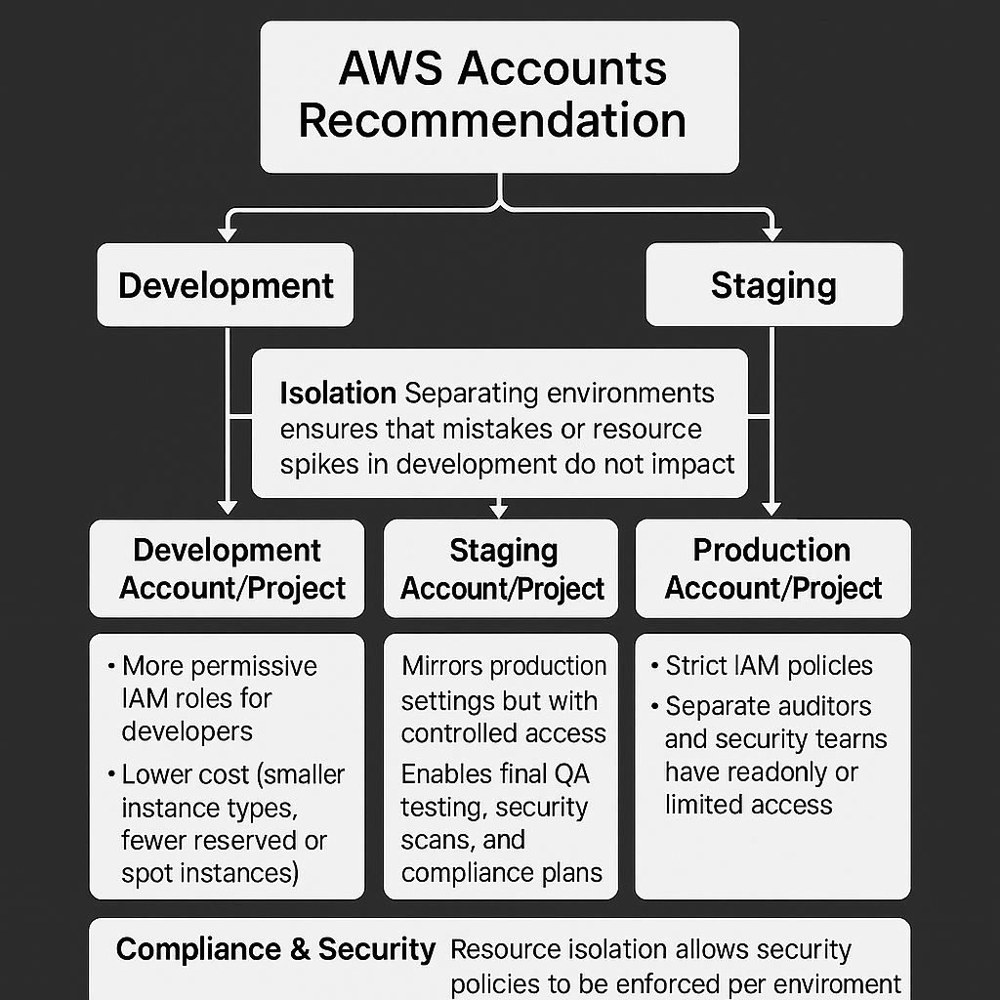
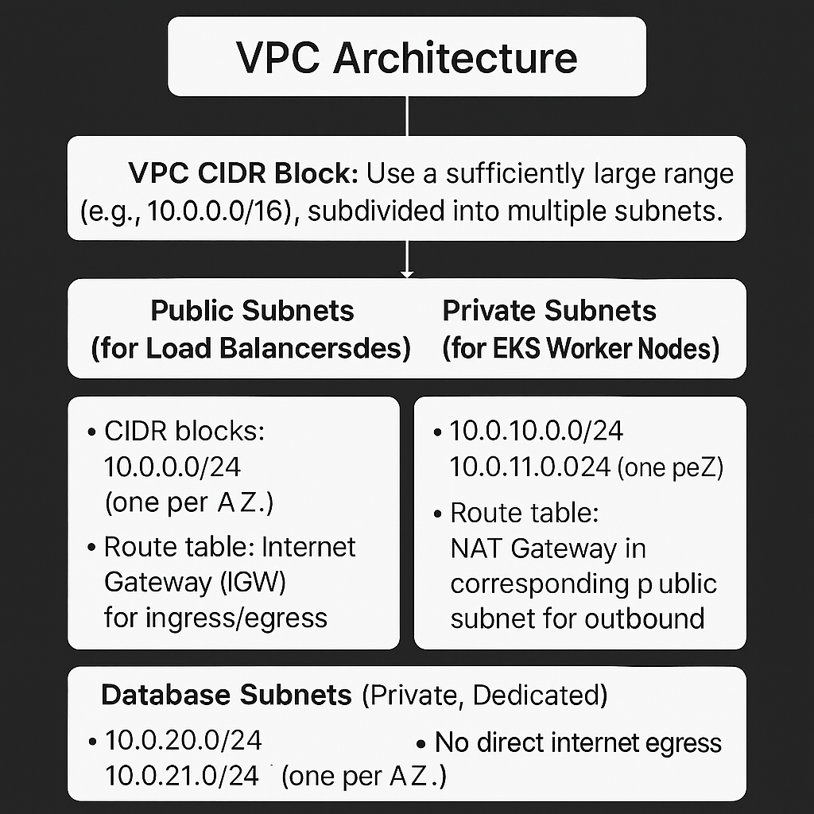
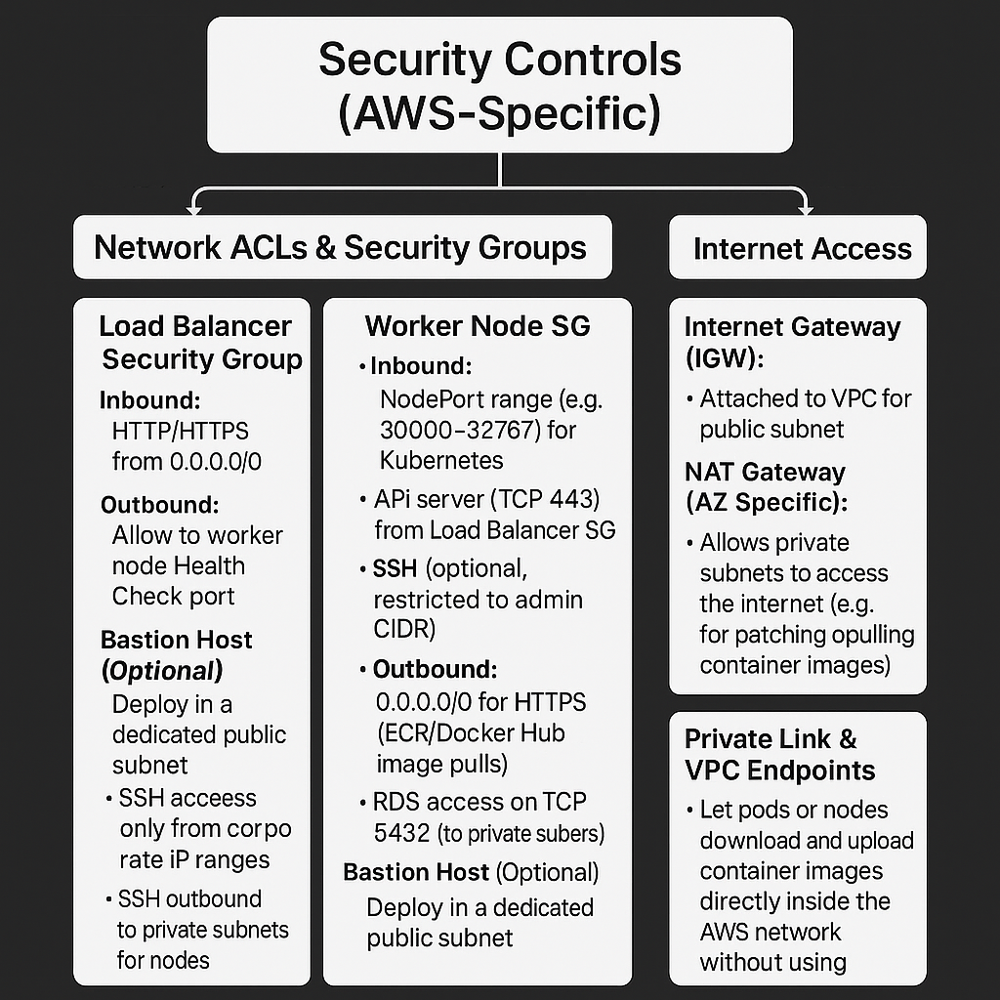
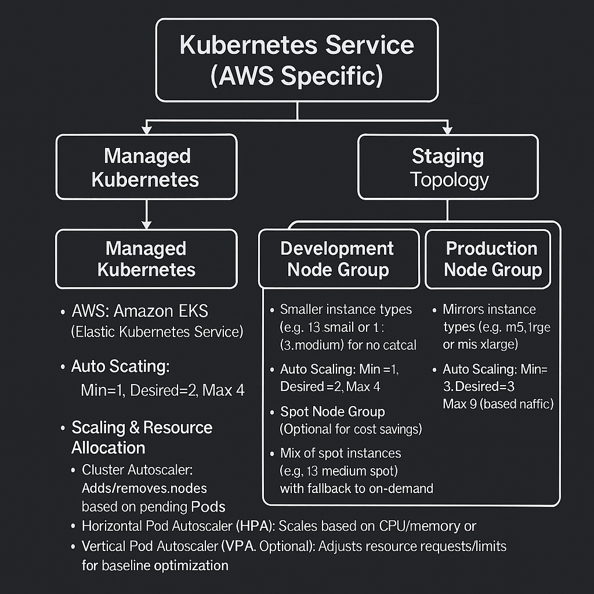
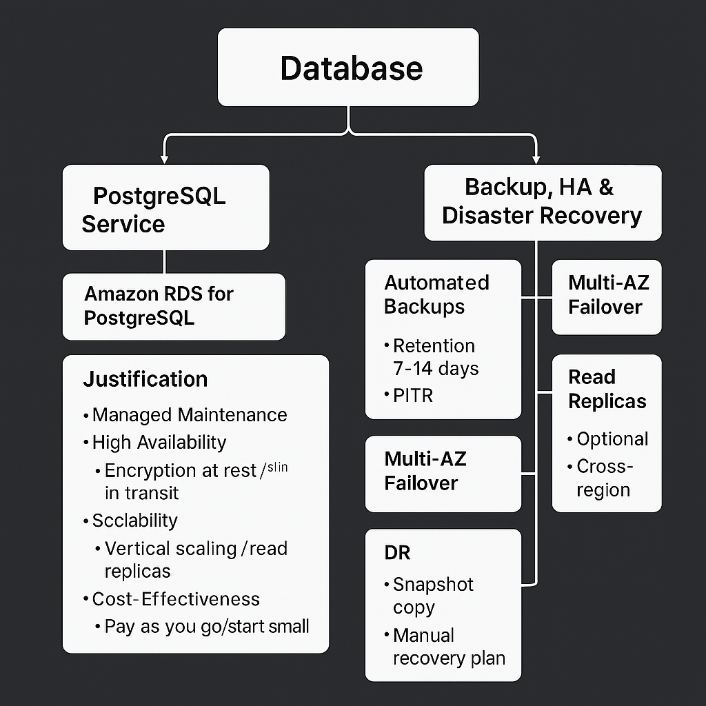

# Innovate Inc. Cloud Architecture Document
> Outline of a robust, scalable, secure, and cost-effective cloud infrastructure for Innovate Inc., using managed Kubernetes and best practices.

### 1.1 AWS Accounts Recommendation

- **Number of Accounts/Projects:**
  - **Development**
  - **Staging**
  - **Production**

- **Purpose:**
  - **Isolation:**  
    Separating environments ensures that mistakes or resource spikes in development do not impact production.

  - **Billing:**  
    Each account/project bills independently, making it easier to track costs per environment.

- **Access Control & Governance:**
  - **Development Account/Project:**
    - More permissive IAM roles for developers.
    - Lower cost (smaller instance types, fewer reserved or spot instances).

  - **Staging Account/Project:**
    - Mirrors production settings but with controlled access.
    - Enables final QA testing, security scans, and compliance validation.

  - **Production Account/Project:**
    - Strict IAM policies.
    - Separate auditors and security teams have readonly or limited access.

- **Compliance & Security:**
  - Resource isolation allows security policies (e.g., KMS, encryption, secret management) to be customized for each environment.

- **Optional Shared Services Account/Project (AWS Organizations):**
  - Hosts cross-account resources like single sign-on (SSO), centralized logging (CloudWatch Logs), and security auditing tools (Config).

  

## 2. Network Design

### 2.1 VPC Architecture

- **VPC CIDR Block:**
  - Use a sufficiently large range (e.g., `10.0.0.0/16`), subdivided into multiple subnets.

- **Subnets (Multi-AZ):**

  - **Public Subnets (for Load Balancers, NAT Gateways):**
    - CIDR blocks: `10.0.0.0/24`, `10.0.1.0/24` (one per AZ).
    - Route table: Internet Gateway (IGW) for ingress/egress.

  - **Private Subnets (for EKS Worker Nodes):**
    - CIDR blocks: `10.0.10.0/24`, `10.0.11.0/24` (one per AZ).
    - Route table: NAT Gateway in corresponding public subnet for outbound internet.

  - **Database Subnets (Private, Dedicated):**
    - CIDR blocks: `10.0.20.0/24`, `10.0.21.0/24` (one per AZ).
    - No direct internet egress (only via NAT in private subnets).

## 2.2 Security Controls

- **Network ACLs & Security Groups:**

  - **Load Balancer Security Group (SG):**
    - **Inbound:** HTTP/HTTPS from `0.0.0.0/0`.
    - **Outbound:** Allow to worker node Health Check ports.

  - **Worker Node SG:**
    - **Inbound:**
      - NodePort range (e.g., `30000–32767`) for Kubernetes.
      - API server (TCP 443) from Load Balancer SG.
      - SSH (optional, restricted to admin CIDR).
    - **Outbound:**
      - `0.0.0.0/0` for HTTPS (ECR/Docker Hub image pulls).
      - RDS access on TCP 5432 (to private subnets).

  - **RDS SG:**
    - **Inbound:** Only from EKS Worker Node SG on TCP 5432.
    - **Outbound:** Not applicable (RDS does not initiate connections).

  - **Bastion Host(Optional):**
    - Deploy in a dedicated public subnet.
    - SG: SSH access only from corporate IP ranges.
    - SSH outbound to private subnets for nodes or chaining.

- **Internet Access:**
  - **Internet Gateway (IGW):** Attached to VPC for public subnet traffic.
  - **NAT Gateway (AZ Specific):** Allows private subnets to access the internet (e.g., for patching or pulling container images).

- **VPC Flow Logs:**
  - Enabled for all subnets. Logs are sent to a centralized CloudWatch Logs group for auditing.

- **Private Link & VPC Endpoints:**
  - **S3 & ECR VPC Endpoints:** Let pods or nodes download and upload container images directly inside the AWS network, without using the public internet.
  - **Secrets Manager & SSM Endpoints:** Apps can safely get secrets and settings without using the public internet.

## 3. Compute Platform

### 3.1 Kubernetes Service (AWS Specific)

- **Managed Kubernetes:**
  - **AWS:** Amazon EKS (Elastic Kubernetes Service)

- **Cluster Topology:**
  - **Control Plane (Managed by AWS):**
    - Spread across multiple AZs.
    - Highly available, auto-patched by AWS.

  - **Worker Nodes (Node Groups):**

    - **Development Node Group:**
      - Smaller instance types (e.g., `t3.small` or `t3.medium`) for non-critical workloads.
      - Auto Scaling: Min=1, Desired=2, Max=4

    - **Production Node Group:**
      - Larger instance types (e.g., `m5.large` or `m5.xlarge`) optimized for CPU/memory.
      - Auto Scaling: Min=3, Desired=3, Max=9 (based on traffic)

    - **Spot Node Group (Optional for Cost Savings):**
      - Mix of spot instances (e.g., `t3.medium` spot) with fallback to on-demand.
      - Used for non-critical, batch, or background jobs (e.g., analytics, logs).

- **Scaling & Resource Allocation:**
  - **Cluster Autoscaler:** Adds/removes nodes based on pending pods.
  - **Horizontal Pod Autoscaler (HPA):** Scales based on CPU/memory or custom metrics.
  - **Vertical Pod Autoscaler (VPA, Optional):** Adjusts resource requests/limits for baseline optimization.
  - **Pod Disruption Budgets (PDBs):** Ensures minimum replicas during node updates.

  

- **Containerization & CI/CD Pipeline:**

  1. **Build Stage:**
     - **Source Repo:** GitHub / Bitbucket (push triggers pipeline)
     - **Build Service:** AWS CodeBuild
     - **Artifact:** Docker image tagged with semantic version

  2. **Container Registry:**
     - AWS Amazon ECR (encrypt images at rest with KMS)

  3. **Security Scanning:**
     - Use Trivy or Clair in CodeBuild to scan images.
     - Fail builds on critical/high vulnerabilities.

  4. **Deployment Stage:**
     - **Infrastructure as Code:** Use Terraform to manage EKS, VPC, IAM, RDS, etc.
     - **Helm Charts or Kubernetes YAMLs:** Stored in Git and deployed via GitOps (e.g., Argo CD or CI pipeline)
     - **Canary / Blue-Green Deployments (Optional):**
       - Use deployment strategies that slowly roll out changes to minimize risk before full release.

  5. **Secrets & Config Management:**
     - AWS Secrets Manager or Parameter Store (KMS-encrypted)
     - Kubernetes secrets via:
       - Kubernetes External Secrets
       - AWS IAM Roles for Service Accounts

  6. **Release Notes:**
     - Release notes are a concise summary of everything that’s landed since the last version, organized by type (features, enhancements, fixes) and drawn directly from merged pull request titles and descriptions. Each entry includes the PR number for easy reference and traceability. WIll be created from the pipeline

## 4. Database

### 4.1 PostgreSQL Service

- **Managed Service:**
  - **AWS:** Amazon RDS for PostgreSQL (Multi-AZ, auto backups)

- **Justification:**
  - **Managed Maintenance:** Automated patching, minor version upgrades, and backups.
  - **High Availability:** Multi-AZ replication enables fast failover within seconds.
  - **Security:** 
    - Encryption at rest using KMS or customer-managed keys (CMEK).
    - Encryption in transit using SSL/TLS.
  - **Scalability:** 
    - Supports vertical scaling (instance resizing).
    - Optionally add read replicas for read-heavy workloads.
  - **Cost-Effectiveness:** 
    - Pay only for the resources you use.
    - Start with smaller instances like `db.t3.medium`.

---

### 4.2 Backup, HA & Disaster Recovery

1. **Automated Backups:**
   - **Retention:** Daily automated snapshots retained for 7–14 days.
   - **Point-in-Time Recovery (PITR):** Enable WAL archiving for recovery to any point within the retention window.

2. **Multi-AZ / Regional Failover:**
   - **RDS Multi-AZ:** Automatically provisions a synchronous standby in another AZ to ensure zero data loss and automatic failover.

3. **Read Replicas (Optional):**
   - Provision read replicas in a different AZ or region to support analytics or offload read traffic from the primary instance.
   - **Cross-Region Replica (Optional):**
     - For geographic redundancy and faster reads from distant locations.
     - Use the `read_replica` parameter with the cross-region flag in Terraform.

4. **Disaster Recovery (DR):**
   - **Snapshot Copy to Another Region:**
     - Schedule daily snapshots to be copied to a secondary AWS region.

   - **Manual Recovery Plan:**
     - Launch a new RDS instance from the latest cross-region snapshot during a disaster.
     - Update application configurations (e.g., ConfigMap or Secret) to point to the new endpoint.

   - **DR Drill Practice:**
     - Periodically test snapshot recovery by restoring into a dev/staging environment to confirm backup integrity.

## Security Controls for Database

5. - **Encryption at Rest:**  
  Use AWS KMS–managed keys or customer-managed keys (CMK).

   - **Encryption in Transit:**  
     Enforce SSL connections by setting the `rds.force_ssl` parameter.

   - **Network Isolation:**  
    Place RDS instances in private subnets with no public IP.

   - **IAM Authentication (Optional):**  
     Use IAM database authentication for short-lived tokens instead of static passwords.

   - **Access Auditing:**  
   - Enable RDS Enhanced Monitoring and CloudTrail logging for all parameter changes.  
   - Enforce database user policies with least privilege.

  

## 5. Security & Compliance Considerations

- **Identity and Access Management (IAM):**
  - **Least Privilege:** Separate IAM roles for EKS (`eks-node-role`, `eks-service-role`) and use IRSA for service accounts.
  - **MFA:** Enforce for all users.
  - **Secure Access:** Use AWS SSM Session Manager instead of direct SSH.

- **Encryption & Key Management:**
  - **KMS:** One key per environment for RDS, ECR, EFS, and EBS; rotate annually.

- **Logging & Monitoring:**
  - **Centralized Logs:** CloudWatch Logs with dedicated log groups for EKS, RDS, and applications.
  - **Metrics & Alerts:**  
    - Prometheus/Grafana on EKS for app and cluster metrics  
    - CloudWatch Container Insights  
    - SNS alerts for CPU/memory, pod restarts, DB connections, and error spikes

- **Policy Enforcement & Compliance:**
  - **IaC & GitOps:** Store all changes in Git; enforce plan/apply via Terraform Cloud or Atlantis with PR reviews.
  - **Policy as Code:** AWS Config, GuardDuty, and Security Hub to enforce CIS benchmarks.

## 6. Cost Optimization Strategies

- **Right-Sizing:**  
  Use AWS Compute Optimizer to analyze instance utilization and adjust instance sizes.

- **Spot & Savings Plans:**  
  - **Non-Critical Workloads:** Deploy on spot instances for batch jobs.  
  - **Long-Term Baseline:** Purchase AWS Savings Plans for 1-year or 3-year commitments.

- **Auto Scaling & Idle Resource Reduction:**  
  - Ensure the cluster autoscaler properly scales down underutilized nodes.  
  - Use AWS Lambda to detect and notify on idle resources (e.g., underutilized RDS instances or unattached EBS volumes).

- **Storage Lifecycle Policies:**  
  Move older snapshots or logs to cheaper tiers (S3 Infrequent Access or Glacier).  

## Summary
| Area                         | Recommendation                                                                                                                                                         |
|------------------------------|------------------------------------------------------------------------------------------------------------------------------------------------------------------------|
| **Accounts/Projects**        | Dev, Staging, Prod (+ Shared Services)                                                                                                                                |
| **VPC**                      | Multi-AZ with public, private, and DB-only subnets; NAT Gateways; IGW; VPC Endpoints                                                                                    |
| **Kubernetes**               | EKS managed control plane; multiple node groups (dev, prod, spot); cluster autoscaler; HPA                                                                               |
| **Containerization & CI/CD** | Terraform + Helm + GitOps (Argo CD/Flux) or CI pipelines (AWS CodeBuild); ECR; image scanning (Trivy)                                                                   |
| **Database**                 | Amazon RDS for PostgreSQL (Multi-AZ); automated backups; read replicas; cross-region snapshot copy                                                                         |
| **Security**                 | Least-privilege IAM; KMS encryption; VPC isolation; private endpoints; Secrets Manager; auditing (CloudTrail, VPC Flow Logs); managed policy enforcement (Config, GuardDuty) |
| **Monitoring & Logging**     | Prometheus/Grafana on EKS; CloudWatch Container Insights; centralized logging in CloudWatch Logs; alerts via SNS                                                         |
| **Cost Optimization**        | Use spot instances for non-critical workloads; Savings Plans; right-sizing via Compute Optimizer; storage lifecycle policies                                              |
| **Operational Workflow**     | Branch-based CI/CD → build → vulnerability scan → deploy to staging → QA → canary/blue-green release to production → rollback policy                                       |
